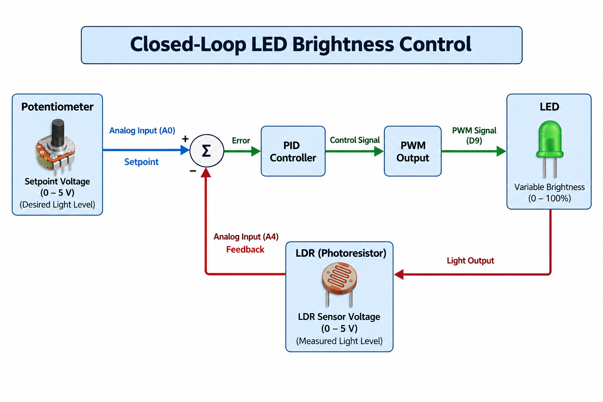
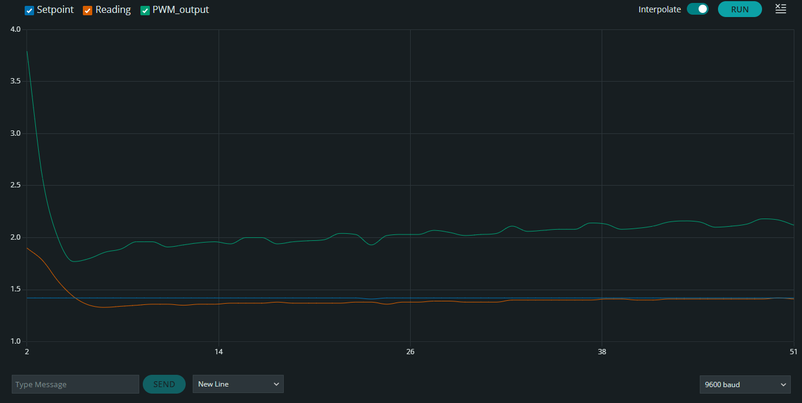
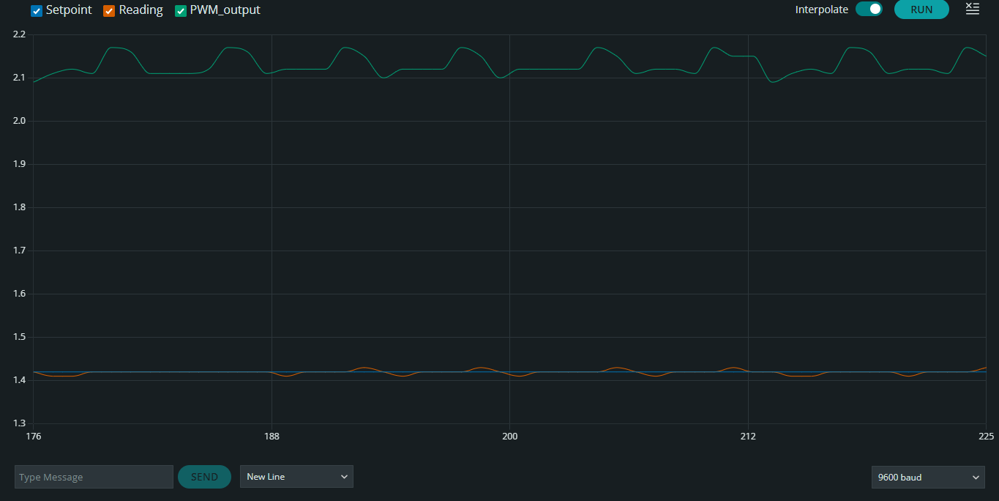
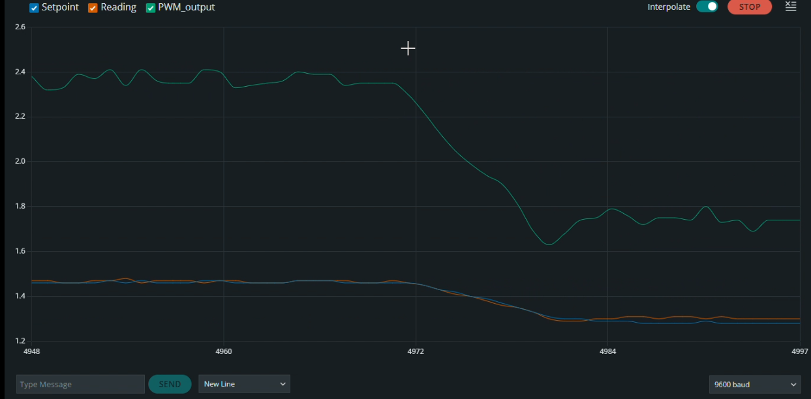
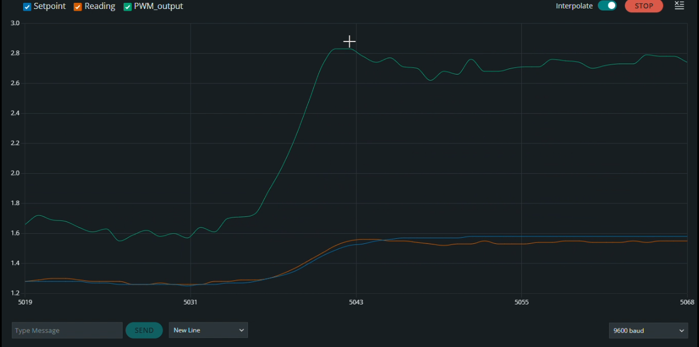
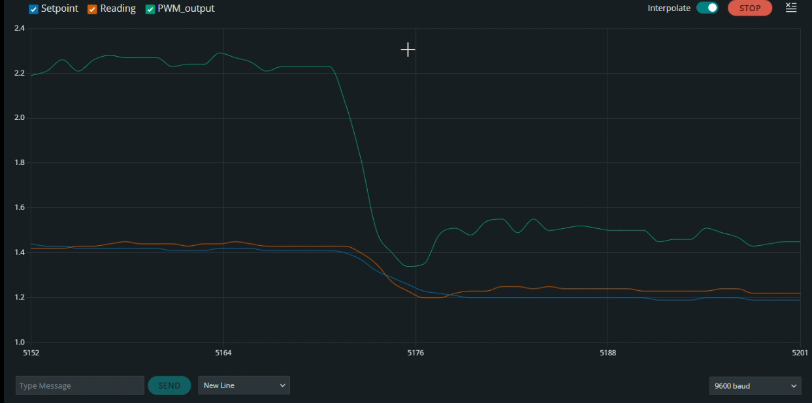

# LDR-LED Closed-Loop Control

I built this project to control the brightness of an LED using feedback from an LDR. An Arduino Uno continuously compares the measured light level with a user-defined setpoint and adjusts the LED brightness through PWM.

## Overview

The idea is simple: instead of setting the LED to a fixed brightness, I wanted the system to automatically maintain a desired light level using feedback from an LDR.

A potentiometer is used to set the desired light level. The Arduino compares this setpoint with the LDR feedback and uses a PID controller to adjust the LED's PWM output and reduce the error between them.

To make the feedback more stable, the LDR and potentiometer signals are filtered using capacitors as well as software filtering.

## System Architecture

The overall control loop is shown below.

The potentiometer provides the reference setpoint. The Arduino compares it with the filtered LDR feedback, calculates the PID control action, and adjusts the LED brightness through PWM. The LDR then measures the resulting light level and feeds it back to the controller.

## Hardware

The prototype was built on an Arduino Uno and a breadboard.

### Main Components

| Component | Purpose |
|---|---|
| Arduino Uno | Executes the PID control algorithm |
| LDR | Light-dependent feedback sensor |
| LED | Controlled light source |
| Potentiometer | Sets the desired sensor voltage |
| 1 kΩ resistors | LDR voltage divider and LED current limiting |
| 100 µF capacitor | LDR signal filtering |
| 10 µF capacitor | Potentiometer signal filtering |

## Pin Configuration

| Component | Arduino Pin |
|---|---|
| Potentiometer | A0 |
| LDR sensor | A4 |
| LED (PWM) | D9 |

## PID Control

The brightness is controlled using a PID controller. The controller compares the desired setpoint with the LDR feedback and adjusts the LED PWM output to reduce the error.

### Control Equation

    Error = Setpoint - Feedback

    PID Output = Kp × Error
               + Ki × ∫Error dt
               + Kd × d(Error)/dt

### Tuned Parameters

| Parameter | Value |
|---|---:|
| Kp | 2.5  |
| Ki | 1.0  |
| Kd | 0.05 |

The gains were tuned experimentally by observing the response and stability of the system. A small derivative gain was retained for the final PID implementation because the LDR signal contains some noise.

## Signal Filtering

The LDR and potentiometer signals showed small fluctuations during testing, so I used both hardware and software filtering.

### Hardware Filtering

A 100 µF capacitor is connected across the LDR signal to reduce rapid fluctuations in the sensor voltage.

A 10 µF capacitor is connected to the potentiometer output to make the setpoint more stable.

### Software Filtering

The LDR reading is also smoothed in software using a simple low-pass filter:

    Filtered = α × Raw + (1 - α) × Previous Filtered

The final value used was:

    α = 0.2

Using both filters gave a more stable feedback signal without significantly affecting the controller response.

## Source Code

The complete Arduino implementation is available here:

[View the Arduino code](src/ldr_led_pid.ino)

The code handles sensor acquisition, signal filtering, PID calculation, PWM control, and serial output for monitoring the system response.

## Experimental Results

### Transient Response

The transient response shows the LDR feedback moving toward the selected setpoint after the system starts.

### Steady-State Response

After settling, the LDR reading remains close to the setpoint while the PWM output continuously adjusts the LED brightness.

### Dynamic Setpoint Response

The setpoint was changed during operation to observe how the controller responds to a new desired light level. The LDR feedback follows the change while the PWM output is adjusted accordingly.

## Final Parameters

| Parameter | Value |
|---|---:|
| Kp | 2.5  |
| Ki | 1.0  |
| Kd | 0.05 |
| LDR filter (α) | 0.2 |
| LDR capacitor | 100 µF |
| Potentiometer capacitor | 10 µF |
| Control loop interval | 100 ms |
| LED PWM pin | D9 |
| LDR input pin | A4 |
| Setpoint input pin | A0 |

## Limitations

The system is intended as a practical control experiment rather than a precision light-measurement system. Small variations in the LDR reading remain due to sensor characteristics, ADC resolution, ambient light, and PWM resolution.

## Future Improvements

Possible improvements include better sensor calibration, a more precise light sensor, systematic PID tuning, improved anti-windup, and a higher-resolution control output.

## Conclusion

This project gave me hands-on experience with closed-loop control by combining sensing, filtering, PID control, and PWM-based actuation on an Arduino Uno.

The system was able to track user-defined light-level setpoints and respond to changes in the measured light level. Through the tuning and testing process, I also gained practical insight into sensor noise, filtering, controller gains, and the trade-off between response speed and stability.
